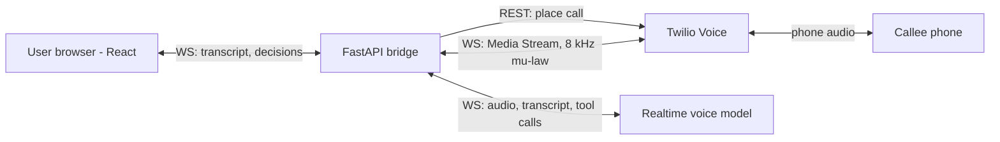
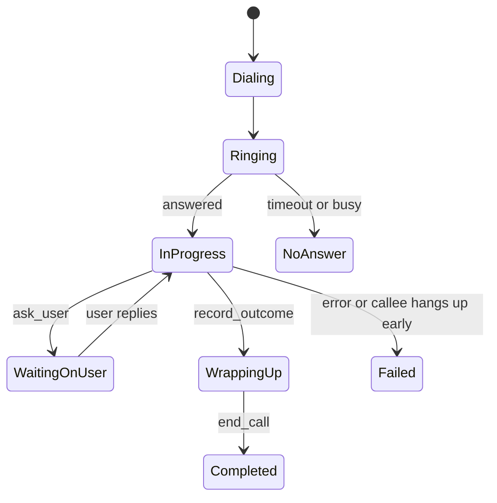

# CallProxy — OwlHacks 2026 Spec

Sep 26, 2026 · @Matt

## Overview

CallProxy places real phone calls for people who can't or won't make them. The user types what they need, an AI voice agent dials, holds the conversation, and streams a live transcript back. When the agent hits a decision it can't make alone, it pauses and asks the user.

**Who it's for**

- Deaf and hard-of-hearing people, who today often route calls through relay services with a human operator in the middle
- People with speech impairments or stutters
- People with phone anxiety who put off calls for days
- Non-native English speakers who struggle with fast phone conversations

**Target tracks:** AI & Agents (primary), Human-Computer Interaction (secondary). The demo scenario, booking a doctor's appointment, also makes a Health & Wellness case.

## Demo script

The demo is three minutes, and a judge's phone ringing on stage is the centerpiece. Everything else supports that moment.

| Time | Beat | What's on screen |
| --- | --- | --- |
| 0:00–0:20 | Hook: "Who here has put off a phone call for a week?" Introduce the persona: a Deaf student who needs a dentist appointment. | Title slide |
| 0:20–0:40 | Fill the task form: call "Dr. Rivera's office," book a cleaning, free Tue/Thu afternoons. Enter the judge's number. | New call form |
| 0:40–2:00 | The judge's phone rings. The judge plays the receptionist from a printed cue card. The agent discloses it's an AI, asks for a slot, and hits a choice ("Thursday 3 PM or Friday 10 AM?"). A decision card pops up, the user taps one, and the agent confirms it. | Live transcript + decision card |
| 2:00–2:30 | The call ends. A summary card shows the booked time and an "Add to calendar" button. | Summary screen |
| 2:30–3:00 | Architecture in one slide, the tracks it hits, and what's next. | Architecture slide |

- Give the judge a printed receptionist cue card so they know to offer two time slots. That guarantees the decision card fires.
- Keep a screen recording of a full successful call as a backup if the wifi or tunnel fails.

## Scope

The MVP is exactly what the demo script needs, and nothing gets built past it until the full call works end to end.

| Feature | Tier | Notes |
| --- | --- | --- |
| Outbound call to a verified number | MVP | Twilio Voice |
| Two-way realtime voice agent | MVP | Speech-to-speech model over a websocket bridge |
| Live transcript in the web UI | MVP | Both speakers, streamed as they talk |
| Task form (who, number, goal, facts, constraints) | MVP | Facts are the only info the agent may share |
| Ask-the-user decision card mid-call | MVP | The HCI centerpiece |
| Post-call summary with outcome | MVP | Status, key details, full transcript |
| Add to calendar (.ics download) | Stretch | Built from the outcome fields |
| Type-to-speak takeover | Stretch | User types a line, the agent says it verbatim |
| Task templates | Stretch | Book appointment, check prescription, cancel subscription |
| Phone menu navigation (press 1) | Stretch | DTMF tool |
| Voicemail detection | Stretch | Leave a message and report back |
| Inbound calls, user accounts, payments | Out of scope | Not needed for the demo |
| Calling real businesses | Out of scope | Only call consenting team and judge phones |

## Architecture

A FastAPI backend bridges three websockets: Twilio's call audio, the voice model, and the user's browser. The bridge forwards audio between Twilio and the model, and taps transcript and tool events off to the browser.



- **Web app (React + Vite):** task form, live call view, summary screen.
- **FastAPI backend:** REST endpoints, Twilio webhooks, and the audio bridge. Call state lives in memory.
- **Twilio Voice:** dials out. On answer, Twilio fetches TwiML with `<Connect><Stream>`, which opens a websocket carrying call audio both ways.
- **Realtime voice model:** hears the callee, speaks back, and emits transcript events and tool calls.

**Voice model options**

| Option | Pros | Cons |
| --- | --- | --- |
| OpenAI Realtime API | Accepts phone-format audio directly; many Twilio examples to copy | No Google-related MLH prize |
| Gemini Live API | May qualify for an MLH prize (Google AI Studio workshop at noon) | Must resample 8 kHz phone audio to and from the model's PCM rates |
| Twilio ConversationRelay (Plan B) | Twilio handles speech-to-text and text-to-speech; you only exchange text with any LLM | Higher latency, less natural voice |

Pick one in the first hour and test a real call with it before building anything else.

## Call lifecycle

Every call moves through eight states, and the UI always shows which one it's in.



| State | Entered when | UI shows |
| --- | --- | --- |
| Dialing | `POST /calls` succeeds and Twilio is placing the call | Spinner, "Calling Dr. Rivera's office" |
| Ringing | Twilio status callback reports ringing | Pulsing phone icon |
| In progress | Callee answers and the media stream opens | Live transcript, call timer, hang-up button |
| Waiting on user | Agent calls `ask_user` | Decision card, plus a vibration or flash alert |
| Wrapping up | Agent calls `record_outcome` | "Confirming details" banner |
| Completed | Call ends after an outcome | Summary screen |
| No answer | Timeout, busy, or voicemail | Retry button |
| Failed | Error, or the callee hangs up before an outcome | What happened, plus the partial transcript |

## Agent design

The agent only knows what the user put in the task, discloses that it's an AI, and asks the user instead of guessing.

**System prompt outline**

1. Identity: "You are an AI assistant calling on behalf of {user\_name}." Say so in the first sentence of every call.
2. Goal: the user's goal, word for word.
3. Facts: the only personal details the agent may share (name, date of birth, callback number, availability).
4. Constraints: time windows, budget limits, things to avoid.
5. Rules:
   - Keep turns under two sentences. Phone calls punish long monologues.
   - Never invent a fact. If asked something not in Facts, call `ask_user`.
   - When offered a choice the constraints don't settle, call `ask_user` with the options.
   - Read back the final details (date, time, name, confirmation number) before ending.
   - If the callee refuses to talk to an AI, apologize, end the call, and report it.

**Tools**

| Tool | Arguments | What happens |
| --- | --- | --- |
| `ask_user` | `question`, `options[]` | Agent says "One moment, let me check," and the bridge pushes a decision card to the UI. The user's reply comes back as the tool result. After 30 seconds with no reply, the agent offers to call back. |
| `record_outcome` | `status` (success, partial, failed), `summary`, `details{}` | Saves the outcome for the summary screen and moves the call to Wrapping up. |
| `end_call` | `reason` | Bridge hangs up via the Twilio API after the agent's goodbye finishes playing. |
| `send_dtmf` (stretch) | `digits` | Presses phone-menu keys. |

**Guardrails**

- Never share payment details, Social Security numbers, or passwords, even if they appear in Facts.
- Hard cap of 5 minutes per call.
- The backend only dials numbers on an allowlist (team and judge phones) during the hackathon.

## API and data model

The backend exposes five REST endpoints for the UI, three for Twilio, and one websocket for live updates. State lives in an in-memory dict keyed by `call_id`, and that's enough for a demo.

| Method | Path | Caller | Purpose |
| --- | --- | --- | --- |
| POST | `/calls` | UI | Create a task and dial. Returns `call_id`. |
| GET | `/calls/{id}` | UI | Current state, transcript, outcome |
| POST | `/calls/{id}/reply` | UI | User's answer to an `ask_user` question |
| POST | `/calls/{id}/say` | UI | Stretch: text the agent speaks verbatim |
| POST | `/calls/{id}/hangup` | UI | End the call now |
| POST | `/twilio/voice/{id}` | Twilio | Returns TwiML: `<Connect><Stream url="wss://…/twilio/media/{id}"/>` |
| POST | `/twilio/status/{id}` | Twilio | Ringing, answered, completed, no-answer callbacks |
| WS | `/twilio/media/{id}` | Twilio | Call audio both ways, bridged to the voice model |
| WS | `/ws/calls/{id}` | UI | Server-to-browser events |

**UI websocket events**

- `status` — `{state}`
- `transcript` — `{speaker: agent | callee | user, text, final}`
- `ask_user` — `{question_id, question, options[]}`
- `outcome` — `{status, summary, details}`

**Core objects**

```python
class CallTask(BaseModel):
    to_number: str
    callee_name: str
    user_name: str
    goal: str
    facts: dict[str, str]
    constraints: list[str] = []

class Call(BaseModel):
    id: str
    task: CallTask
    state: Literal["dialing", "ringing", "in_progress", "waiting_on_user",
                   "wrapping_up", "completed", "no_answer", "failed"]
    twilio_sid: str | None = None
    transcript: list[TranscriptTurn] = []
    outcome: Outcome | None = None

class TranscriptTurn(BaseModel):
    speaker: Literal["agent", "callee", "user"]
    text: str
    ts: float

class Outcome(BaseModel):
    status: Literal["success", "partial", "failed"]
    summary: str
    details: dict[str, str]  # e.g. date, time, confirmation number
```

## Frontend

The app has three screens, and the live call view is where the HCI judges will spend their attention.

1. **New call**
   - Fields: who you're calling, phone number, your name, goal (free text), facts as key-value rows, constraints.
   - Stretch: template buttons that prefill the form (book appointment, check prescription, cancel subscription).
2. **Live call**
   - Status pill and call timer at the top.
   - Chat-style transcript: agent on the right, callee on the left, partial text shown in gray until final.
   - Decision card slides up over the transcript, with the options as big buttons plus a free-text answer.
   - Hang-up button, always visible.
   - Stretch: a "Say this" text box for type-to-speak takeover.
3. **Summary**
   - Outcome badge, one-line summary, key details (date, time, confirmation number).
   - "Add to calendar" (.ics download) and the full transcript.

**Accessibility requirements** (judges in the HCI track will check these)

- Transcript container uses `aria-live="polite"` so screen readers announce new lines.
- Decision card takes focus when it appears and works with the keyboard alone.
- A decision alert uses a screen flash and phone vibration, never sound alone.
- Text scales to 200% without breaking layout, and color contrast meets WCAG AA.

## Tech stack and setup

The stack is Python on the backend and React on the front. The riskiest setup item is the Twilio account, so do it first.

| Layer | Choice | Why |
| --- | --- | --- |
| Backend | FastAPI + uvicorn | Native async websockets for the audio bridge |
| Telephony | Twilio Voice + Media Streams | Outbound calls with raw audio over a websocket |
| Voice model | Realtime speech-to-speech API (see Architecture) | Low latency, built-in turn detection |
| Frontend | React + Vite + Tailwind | Fast to scaffold |
| Public URL | ngrok or cloudflared tunnel | Twilio needs a public `https` and `wss` address |
| Storage | In-memory dict | No database needed for a demo |

**Setup checklist**

- [ ] Create a Twilio account and get a phone number
- [ ] Upgrade the account (about $20). Trial accounts only dial verified numbers and play a trial announcement before the call connects, which would wreck the demo.
- [ ] Get a voice model API key and confirm it works with a hello-world request
- [ ] Start a tunnel and put its URL in `.env` as `PUBLIC_URL`
- [ ] Scaffold the repo: `/backend` (FastAPI) and `/web` (Vite React)
- [ ] `.env` holds `TWILIO_ACCOUNT_SID`, `TWILIO_AUTH_TOKEN`, `TWILIO_NUMBER`, model key, `PUBLIC_URL`, `ALLOWED_NUMBERS`
- [ ] First milestone: a script that dials your phone and plays a `<Say>` message

## Risks and mitigations

The biggest risks are audio plumbing and the demo room, not the AI. Both have cheap fixes if you plan for them early.

| Risk | Mitigation |
| --- | --- |
| Audio format mismatch between Twilio and the model | Test a real two-way call in the first few hours. Twilio sends 8 kHz mu-law in base64 frames. |
| Agent talks over the callee | When the model detects the callee speaking, send Twilio a `clear` message to flush queued audio, then cancel the model's current response. |
| Awkward pauses | Use a speech-to-speech model rather than separate speech-to-text, LLM, and text-to-speech steps. Keep the prompt short. Have the agent say "one moment" before any tool call. |
| Agent invents details | Strict Facts list, `ask_user` for anything else, and a low temperature. |
| Trial account limits | Upgrade the Twilio account before the demo. |
| Wifi or tunnel drops during judging | Run from a phone hotspot, and keep the recorded backup video ready. |
| Loud demo floor | Put the judge's phone on speaker in a quieter spot, and put the transcript on the big screen so the audience follows along. |
| Misuse and ethics questions | AI disclosure in the first sentence, a number allowlist, the 5-minute cap, and the user watching live. |

## Build timeline

The full demo flow should work by 10 PM Saturday, leaving the night for polish and the morning for rehearsal. Projects are due at 10 AM Sunday. If you start later than noon, shift everything but keep the gates.

| Time | Voice / backend | Frontend / UX | Gate |
| --- | --- | --- | --- |
| Sat 12–2 PM | Twilio setup, tunnel, outbound call that plays `<Say>` | Scaffold, new call form | Your phone rings |
| Sat 2–6 PM | Media stream bridge to the voice model, system prompt v1 | Live call view against mock events | A two-way conversation with the agent on a real phone |
| Sat 6–7 PM | Dinner | Dinner |  |
| Sat 7–10 PM | UI websocket events, `ask_user`, `record_outcome`, `end_call` | Wire the real websocket, decision card, summary screen | The full demo script runs end to end |
| Sat 10 PM–1 AM | Barge-in handling, prompt tuning, number allowlist | Accessibility pass, visual polish | Five clean test calls in a row |
| Sun 1–7 AM | Stretch goals, then sleep in shifts | Stretch goals, then sleep in shifts | Feature freeze at 7 AM |
| Sun 7–9 AM | Record the backup video, write the README | Pitch slides, judge cue card, Devpost write-up | Demo rehearsed five times |
| Sun 9–10 AM | Final checks | Submit | Submitted before 10 AM |

With a third teammate, give them the pitch, the cue card, the backup video, and testing from the start of the evening.

## Judging pitch

Lead with the person who needs this, and let the live call prove it works. Tailor the closing line to whoever is judging.

| Track | Talking point |
| --- | --- |
| AI & Agents | It acts in the real world: a live phone call with realtime voice, tool use, and a human in the loop for decisions. |
| HCI | It redesigns the phone for the people it shuts out. The user stays in control through the decision card, and the transcript works with screen readers. |
| Health & Wellness | Booking appointments and checking prescriptions are the calls people put off, and putting them off delays care. |

**Likely judge questions**

- *"Isn't this what relay services do?"* Relay services put a human operator in the middle. CallProxy is instant, private, and works at 2 AM for a pharmacy's automated line.
- *"Couldn't someone use this for spam?"* It discloses that it's an AI, only calls when the user starts a task and is watching, and caps call length. Mention the allowlist you used here.
- *"How fast is it?"* Measure the gap between the callee finishing a sentence and the agent answering during your test calls, and quote that number.
- *"What's next?"* Phone menu navigation, voicemail handling, and call-back when the user can't answer a decision in time.
